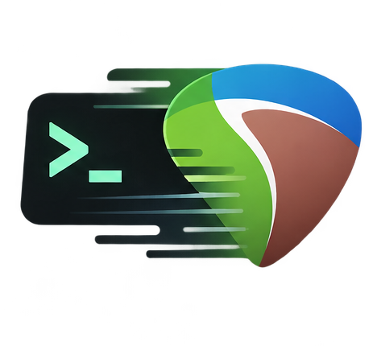

> **Ecosystem alpha:** source packages now live in `packages/reacli` and `packages/reaper-parser`.
> Install both together. ReaperDoc is in `apps/reaperdoc`; shared specifications are in `schema/rpp`.
> See [ecosystem installation, data demo and validation boundaries](docs/ecosystem/README.md).

<p align="center"></p>
<h1 align="center">Rea-Cli</h1>

<p align="center"><strong>REAPER coding. REAPER executing. REAPER verifying.</strong></p>
<p align="center">RPP-as-code · Lua/ReaScript · Agent 接入 · 工程/音频验证</p>
<p align="center">
  <a href="README.md">English</a> · 简体中文 ·
  <a href="docs/README.md">文档</a> ·
  <a href="examples/create_project.py">完整示例</a>
</p>

---

Rea-Cli 是一个可以接入主流 agentic harness 的 Python 库、CLI 和 REAPER 参考环境，
面向 [REAPER](https://www.reaper.fm/) 工程自动化。在这里，RPP 被视为工程源码：
agent 可以编写或修改它，`rac` 负责预检查和检查，REAPER 仍是权威的 parser 和执行环境。
此外，项目还支持 Lua ReaScript 编写、隔离执行，以及保存后工程和渲染音频的验证。

Rea-Cli 本身不是完整的 agent harness，也不是持久化的 REAPER 远程控制服务器。
Python 库用于编程式工作流，CLI 用于检查和隔离执行，仓库内的 skill 则用于向 agent
注入 Rea-Cli 相关的工程知识。

**当前状态：** 0.1.0 alpha，正在准备 PyPI 发行；正式发布前请从源码安装，API 后续可能调整。
安装包与 CLI 名称为 `reacli`，Python 导入名为 `rac`。

## 快速开始：从零构建可播放工程


这个演示会从空白工程构建一个可直接播放的 REAPER session。请先完成[源码安装](#安装)，
并按[环境指南](docs/environment.md)配置 REAPER，再在仓库根目录运行：

```bash
reacli init
reacli doctor --json
python examples/show_session.py ./demo/my-first-session
```

在 REAPER 中打开 **`demo/my-first-session/Show-Session.rpp`**，按播放即可。
工程内嵌 MIDI，并使用 REAPER 自带的 **ReaSynth**，不需要音频素材或第三方乐器。
每次运行请使用新的输出目录；需要 WAV 预览时追加 `--render`。如果找不到 ReaSynth，
请按[环境指南](docs/environment.md#plugin-discovery-and-macos-window-restoration)准备独立资源的 VST 索引。

GIF 展示的工程结构、效果器设置、验证边界和 52 个构建中间状态（checkpoint），见[可播放演示指南](examples/README.md#playable-show-demo)。

### 不启动 REAPER 的快速体验

也可以先检查内置空工程：

```bash
reacli doctor --profile offline --json
reacli resources --output ./quickstart
reacli rpp validate ./quickstart/minimal.rpp
reacli knowledge api GetTrack
```

校验结果应为 `ok: true`、轨道数为 0。资源导出不会覆盖已有文件，重复运行时请使用新目录。

## 项目亮点

| 重点 | Rea-Cli 的做法 | 与常见替代方案的区别 |
|---|---|---|
| 面向 turn-taking agent | 每一轮都有明确的源码、隔离执行、产物和验证结果 | [`reapy`](https://github.com/RomeoDespres/reapy)、[`reaper-daemon`](https://github.com/wretcher207/reaper-daemon)、OSC 和类似项目更适合连续 live session，但也会带来更多隐式会话状态 |
| REAPER API 接入 | 保留原生 Lua/ReaScript 作为最终扩展路径；agent 可以依据 reference 直接编写宿主侧操作，不必等待每个 API 都被包装成工具 | 高层 wrapper 和 [`reaper-cli`](https://github.com/EmNudge/reaper-cli) 这类 tool catalog 提供现成命令，但工具数量本身也会形成维护面 |
| RPP-as-code | 将 RPP 视为工程源码/声明式工程语言；`rac` 提供 pre-check、查询和 diff，REAPER 负责权威解析和执行 | [`rpp`](https://github.com/Perlence/rpp) 这类 RPP 项目通常专注 parser/emitter，实时控制项目则专注向宿主发送命令 |
| 结果验证 | 将语法检查、保存后工程断言、执行 proof 和渲染音频检查接到同一条流程中 | 很多 live-control 集成把命令发送和验收逻辑分开处理 |
| 接入主流 harness | Python 库、CLI 和仓库 skill 可以接入现有 agent harness；Rea-Cli 不试图替代主 harness | MCP server、daemon 或 standalone agent 通常自带控制面和生命周期管理 |
| 执行方式 | 单次任务不需要为每轮都维护常驻 bridge，同时可用 `Pool` 执行相互独立的任务 | 需要低延迟交互控制时，常驻 bridge 和 OSC 仍然更合适 |

在这个工作流中，大面积 RPP 修改由 agent 或外围 harness 完成。`rac` 是 pre-check
和验证层，不替代 REAPER 的 parser、工程语义或执行环境。

## 可以做什么

- **处理 RPP 源码。** 预检查、查看和比较轨道、媒体项及标记；保留未修改的文本和插件数据，
  由 agent 编写工程变更。
- **编写脚本。** 用已有操作集生成建轨、MIDI 音符、效果器、发送路由和标记等 Lua 操作。
- **执行 REAPER。** 使用独立配置及并发 worker，另存工程，并保留输入快照、日志和执行记录。
- **验证结果。** 断言工程属性，检查 PCM WAV 的时长、静音、削波及测试音的主频。
- **查询知识。** 查询内置 API 和格式索引，或阅读仓库中的[开发规范](reference/README.zh-CN.md)。

基本流程：

```text
Agent / Python / CLI → RPP 或 Lua 源码 → rac pre-check → REAPER → 保存工程 / 渲染音频 → 验证
```

## 安装

使用 **Python 3.10+**，在源码目录中创建独立环境：

```bash
python3 -m venv .venv
source .venv/bin/activate
python -m pip install --upgrade pip
python -m pip install ./packages/reaper-parser ./packages/reacli
reacli --version
```

REAPER 需要单独安装。其他依赖取决于使用方式：

- **离线 RPP 检查：** 只需要 Python。
- **生成 Lua：** 需要 Lua 5.3 或 5.4 的 `luac` 编译器进行语法检查。
- **实机执行：** 需要 macOS 或 Linux 上的 REAPER 7.x。macOS 需配置 CoreAudio 输出；
  Linux 需安装相关系统库，并提供 X 显示环境或 Xvfb。

macOS 请先检查 `python3 --version`，系统解释器可能仍为 3.9。
使用 Homebrew 时可安装新版 Python 和 `lua@5.4`，再用新版解释器创建环境。
完整的平台配置、程序路径与排错说明见[环境指南](docs/environment.md)。

## 一个简短的 Python 示例

下面使用第一步导出的 `quickstart` 资源，创建一条 **Vocal** 轨道，
将音量设为 **−6 dB**，另存并验证工程：

```python
from pathlib import Path
from rac.luagen import generate
from rac.rpp import parse
from rac.runner import run
from rac.verify import expect

root = Path("quickstart")
script = generate({"ops": [
    {"op": "track.create", "args": [0, "Vocal"]},
    {"op": "track.set_volume_db", "args": [0, -6.0]},
]}, root / "create.lua")

proof = run(
    root / "minimal.rpp", script,
    save_as=root / "created.rpp",
    run_root=root / "runs",
)
assert proof.ok, proof.to_dict()
expect(parse(root / "created.rpp")).track_count(1).track(0) \
    .name("Vocal").volume(10 ** (-6 / 20))
print(proof.run_dir)
```

同一个生成的脚本也可以通过 CLI 执行：

```bash
reacli exec --project ./quickstart/minimal.rpp \
  --script ./quickstart/create.lua --save-as ./quickstart/created.rpp \
  --run-root ./quickstart/runs
```

完整的可运行示例见 [examples/create_project.py](examples/create_project.py)。

## 默认启动行为

现有 `run()` 和 `Pool.map()` 调用无需增加参数：

- 未明确配置 VST 扫描选项时，默认**不在启动时重新扫描**；macOS 会补充本机已有的 VST 索引。
- 未明确配置 macOS CLAP 路径时，使用独立资源目录内的路径。
- macOS 自动化实例禁用窗口状态恢复，避免强制停止后的 Reopen 弹窗阻塞。

已有明确插件设置会保留。新增插件需要主动扫描，自定义 CLAP 路径仍可能触发发现过程。
这些默认设置不会阻止工程实际使用的插件加载，也无法排除插件自身的弹窗。
详见[插件配置说明](docs/environment.md#plugin-discovery-and-macos-window-restoration)。

## 使用边界

- 进程完成不代表所有操作都成功。应检查 `proof.result` 与日志，再断言所需工程或音频属性。
- 脚本以当前用户权限运行。runner 打开原工程路径以保留相对素材引用，生成脚本支持另存副本；
  尝试修改重要工程时请使用副本。
- 执行层支持 macOS 和 Linux，尚未实现 Windows 执行。不同 REAPER 版本及第三方插件需在目标机器验证。
- 音频检查支持单声道或双声道的 16/24-bit PCM WAV，响度为近似测量；工程结构相同不代表声音完全相同。

已测试的环境与验证范围见[验证记录](docs/validation.md)。

## 开发

```bash
python -m pip install -e ./packages/reaper-parser -e './packages/reacli[audio,dev]'
python -m pytest                         # 默认跳过实机测试
RAC_TEST_LIVE=1 python -m pytest -m live  # 需先配置本机 REAPER
npm ci --prefix apps/reaperdoc
python tools/build_release.py --output dist/new-candidate
python -m twine check dist/new-candidate/reacli/* dist/new-candidate/reaper-parser/*
python scripts/check_dist.py dist/new-candidate/reacli
```

仓库按运行代码、示例和参考资料划分：

```text
packages/reacli/src/rac/     Python 库、CLI 及内置运行资源
examples/    可运行的工作流示例
tests/       离线测试、按需启用的实机测试与合成素材
docs/        环境、API、验证及发布文档
reference/   双语开发规范及历史证据，不进入 wheel 或 sdist
integrations/agents/  可独立安装的 REAPER agent bundle
scripts/     环境引导与发行包检查
.github/     CI、问题模板和手动发布工作流
```

开发约定见 [CONTRIBUTING.md](CONTRIBUTING.md)。
虚拟环境、REAPER 执行产物和本地配置已由 Git 忽略。

## Rea-Cli Agent skill

仓库包含 [`reaper-agent-cli`](integrations/agents/reaper-agent-cli/SKILL.md)。它更准确的定位是
“把 Rea-Cli 接入现有 agent harness、并支持围绕 Rea-Cli 进行二次开发的知识与工作流 skill”，
而不是完整 harness，也不是可以脱离仓库复制使用的通用 REAPER skill。它会引导 AI agent
遵循 RPP、ReaScript、Lua 和 JSFX 规范，使用 `rac` / `reacli` 预检查、查看和验证工程，
在已有高层操作无法覆盖需求时编写自定义 Lua，执行独立任务，并检查保存后的工程或渲染音频。

这个 skill 并非自包含：使用它需要完整的 Rea-Cli 仓库副本、从该仓库安装的 `reacli`，
以及可访问仓库中的 `reference/`、`examples/` 和安装包内资源。它不会安装 REAPER，
也不要求 MCP 服务器。

使用该 skill 时，预期的响应/交付内容包括用户要求的工程或脚本、必要的媒体或合成说明，
以及简洁的验证结果；相关 REAPER/插件版本和未经测试的行为应明确注明。具体的任务路由
和边界见 [skill 中文说明](integrations/agents/reaper-agent-cli/GUIDE.zh-CN.md) 及
[English guide](integrations/agents/reaper-agent-cli/SKILL.md)。

## 文档入口

- [环境配置与排错](docs/environment.md)
- [Python API 与 CLI 行为](docs/api.md)
- [验证记录](docs/validation.md)
- [自动化开发规范](reference/README.zh-CN.md)：[调用](reference/workflow/README.zh-CN.md) · [RPP](reference/rpp/README.zh-CN.md) · [ReaScript](reference/reascript/README.zh-CN.md) · [Lua](reference/lua/README.zh-CN.md) · [JSFX](reference/jsfx/README.zh-CN.md)
- [Agent skill](integrations/agents/reaper-agent-cli/SKILL.md) · [中文使用说明](integrations/agents/reaper-agent-cli/GUIDE.zh-CN.md)
- [更新记录](CHANGELOG.md) · [发布流程](docs/releasing.md)

## 许可证

项目代码采用 [MIT 许可证](LICENSE)。导入资料的来源与再分发注意事项见
[THIRD_PARTY_NOTICES.md](THIRD_PARTY_NOTICES.md)。REAPER 和第三方插件不包含在项目中，
分别遵循自身许可证。本项目独立维护，与 Cockos 无隶属关系。
